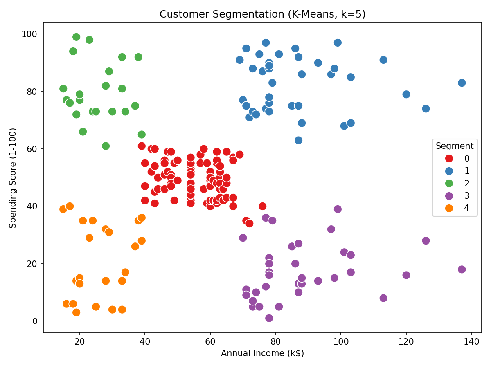

# Customer Segmentation with K-Means Clustering

Applies unsupervised machine learning to group mall customers into
distinct behavioral segments based on income and spending patterns —
turning raw transactional attributes into actionable customer personas.



## Problem

A retail business has hundreds of customers but no clear way to group
them by behavior — who are the big spenders, who has high income but
doesn't spend much, and who are the budget-conscious shoppers? Answering
this manually doesn't scale.

## Approach

1. Explored a dataset of 200 mall customers (age, annual income, spending
   score)
2. Visualized the relationship between annual income and spending score
3. Applied **K-Means clustering** (k=5) to segment customers into 5
   distinct groups
4. Profiled each segment by average age, income, and spending behavior

## Results

Five clear customer personas emerged:

| Segment | Avg Age | Avg Income (k$) | Avg Spending Score | Persona |
|---|---|---|---|---|
| 0 | 42.7 | 55.3 | 49.5 | Average / mid-tier customers |
| 1 | 32.7 | 86.5 | 82.1 | **High income, high spending** — prime target for premium offers |
| 2 | 25.3 | 25.7 | 79.4 | Low income, high spending — young, impulsive spenders |
| 3 | 41.1 | 88.2 | 17.1 | **High income, low spending** — opportunity segment worth re-engaging |
| 4 | 45.2 | 26.3 | 20.9 | Low income, low spending — budget-conscious shoppers |

This kind of segmentation is what powers targeted marketing, personalized
recommendations, and smarter customer retention strategies in the real
world — e.g. sending premium offers to Segment 1, and win-back campaigns
to Segment 3.

## Tech stack

- Python
- pandas — data handling
- scikit-learn — K-Means clustering
- matplotlib / seaborn — visualization

## Project structure

```
customer-segmentation-kmeans/
├── customer_segmentation.ipynb   # full notebook with code + outputs
├── Mall_Customers.csv            # dataset
├── segmentation_plot.png         # cluster visualization
├── segment_profile.csv           # average age/income/spending per segment
└── README.md
```

## How to run

```bash
git clone https://github.com/<your-username>/customer-segmentation-kmeans.git
cd customer-segmentation-kmeans
pip install pandas scikit-learn matplotlib seaborn jupyter
jupyter notebook customer_segmentation.ipynb
```

## Possible extensions

- Use the **elbow method** or **silhouette score** to justify the choice
  of k=5 rather than assuming it
- Include `Age` as a third clustering feature (currently only income and
  spending score are used)
- Build a small Streamlit app so segment assignment updates live as new
  customers are added
- Compare K-Means against hierarchical clustering or DBSCAN

## Author
Kusuma Somashatti - [GitHub](https://github.com/kusumasomashattiecerymec-crypto) | [LinkedIn](www.linkedin.com/in/kusuma-somashatti)
